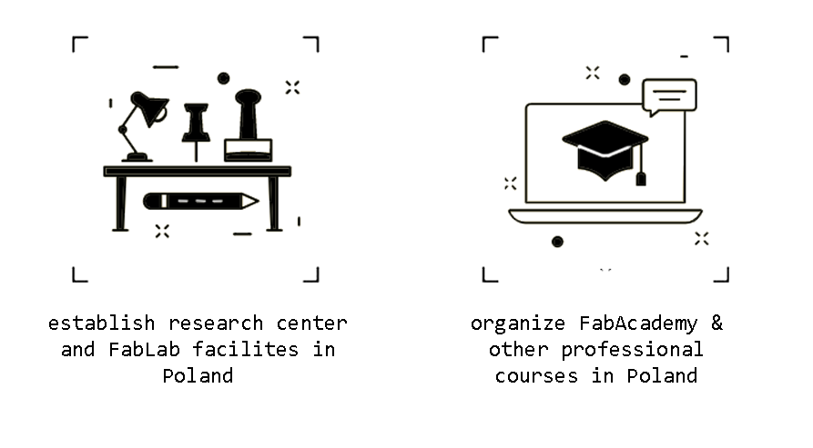
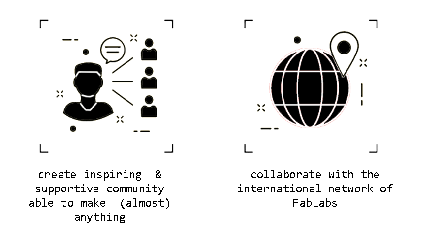

##Fab Foundation Poland is:

- **a non-profit organisation** (verified for Google Nonprofits- Charity ID: 8982288193) and,
-  **a research and knowledge-dissemination organisation** (compling with the *art. 2 pkt. 83 of COMMISSION REGULATION (EU) No 651/2014 of 17 June 2014 declaring certain categories of aid compatible with the internal market in application of Articles 107 and 108 of the Treaty* [link](https://eur-lex.europa.eu/legal-content/EN/TXT/PDF/?uri=CELEX:32014R0651))

**Our aim:** Conducting public benefit activities in the scientific, scientific and technical, educational, cultural and artistic spheres. Conducting basic research, industrial research, experimental development and disseminating the results of such activities on a large scale through teaching, publication, and knowledge transfer in the field of broadly understood innovation with particular emphasis on digital fabrication, design technologies and art.

**Our mission** is to:

- establish a research center into digital design, fabrication and art
- provide the fab lab facilities to public in Poland
- organize the Fab Academy course led by prof. Neil Gershenfeld (MIT) in Poland
- develop open-source projects to help the housing crises in Poland & Ukraine
- create inspiring environment & supportive community for people of any age, race, orientation, prior experience to make them feel cable of creating (almost) anything

**Fig.** Judy receives her Fab Academy diploma and blessings for Fab Foundation Poland from Prof. Neil Gershenfeld. MIT. Boston. 15th August 2023.
