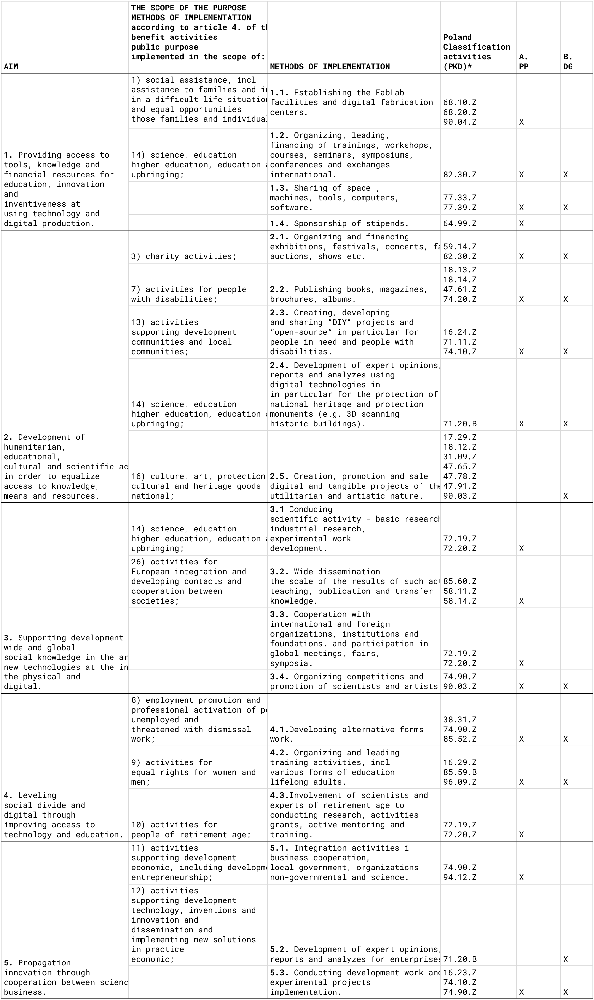

## Fab Foundation Poland

STATUTE
Fab Foundation Poland
Consolidated text as of January 23, 2023.

##Chapter I
###General provisions

**§ 1**

1. Fab Foundation Poland, hereinafter referred to as the Foundation, established by Judyta Maria Cichocka and Anna Helena Malinowska, hereinafter referred to as the Founders' Presidium.
2. The Foundation is established by a notarial deed drawn up by notary public Anna Białecka at the notary office in Wrocław, Śrutowa 4/2, on January 23, 2023.
3. The Foundation operates on the principles set out in the Act of 6 April 1984 on foundations (Journal of Laws 2020.2167, as amended), the Act of 24 April 2003 on public benefit activities and volunteer work (Journal of Laws 2020.1057, as amended). . amended). and in this statute.
4. The Foundation is apolitical and not affiliated with any religion.
5. The activities of the Foundation are consistent with the fundamental interests of the Republic of Poland, the European Union and support the global interests of society.

**§ 2**

1. The Foundation has legal personality.
2. The seat of the Foundation is the capital city of Wrocław.
3. The Foundation operates in the territory of the Republic of Poland and beyond its borders.
4. The Foundation has the right to appoint subordinate units.
5. The Foundation may be a member of domestic and foreign organizations of the same or similar nature of activity.
6. The Foundation may participate in companies and other legal forms.
7. The Foundation may conduct business activity.
8. The Foundation may operate remotely.
9. The Foundation was established for an indefinite period.

**§ 3**

The Foundation may establish badges and medals of honor and award them, together with other awards and distinctions, to natural and legal persons who have rendered great service to the Foundation.

**§ 4**

The Foundation may use the following abbreviation of its name: FFP, a distinctive graphic sign with an inscription indicating its name, and equivalents of its name in foreign languages. The Foundation may use a seal with an inscription indicating its name and seat. The seal may also contain the Foundation's mark. The Foundation may use the Fab Foundation and Fab Lab logos on the terms set out by these organizations.

**§ 5**

The minister responsible for the Foundation's affairs is the minister of education and science. 

##Chapter II
###Objectives and Activities of the Foundation

###Purpose of the Foundation

**§ 6**

The Foundation was established for socially useful activities, carried out in the sphere of public tasks specified in art. 4 of the Act of 24 April 2003 on public benefit activities and volunteer work. In particular, the Foundation conducts public benefit activities in the scientific, scientific and technical, educational, cultural and artistic spheres. Conducting basic research, industrial research, experimental development and disseminating the results of such activities on a large scale through teaching, publication and knowledge transfer in the field of broadly understood innovation with particular emphasis on digital fabrication, design technologies and art.

###Statutory goals and activities of the Foundation

**§ 7**

Statutory objectives and methods of their implementation are listed and described in Table 1.

**§ 8**

The Foundation pursues its statutory objectives by:

**A.** Public benefit activity **(PP)**

**B.** Economic activity **(DG)**

**Table 1.** Statutory goals, their scope, activities of the foundation and the Polish Classification of Activities.

**§ 9 **

In order to achieve its goals, the Foundation may support the activities of other people and institutions convergent with its goals.

**§ 10 **

1. The Foundation conducts business activity to the extent necessary to achieve its goals. 
2. The Foundation may conduct business activity in Poland and abroad in accordance with applicable regulations.
3. The Foundation's economic activity may also be carried out through participation in civil and commercial law companies, including companies with participation of foreign entities on the terms set out in the relevant regulations.

###Accounting and Finance

**§ 11 **

1. The Foundation keeps accounts in accordance with the regulations applicable to legal persons, with the possibility of separating public benefit activities and economic activities.
2. The amount of employment, rules of remuneration and funds allocated for remuneration are determined by the Management Board of the Foundation.
3. Components of fixed assets used in public benefit and business activities are subject to depreciation and redemption in accordance with the applicable rules.
4. Decisions regarding financial and economic undertakings are made by the Management Board of the Foundation.
##Chapter III
###Foundation's assets and income

**§ 12 **

1. The property of the Foundation is its founding fund in the amount of PLN 2,000.00 (say: two thousand zlotys) and other property acquired by the Foundation in the course of its operation.
2. The founding fund is allocated in the amount of PLN 1,000.00 (say: one thousand zlotys) for statutory activity and PLN 1,000.00 (say: one thousand zlotys) for business activity. 3. The Foundation's income may come in particular from:
a. donations, inheritances, bequests;
b. grants and subsidies;
c. income from collections and public events;
d. proceeds from statutory activities;
e. profit on deposits in banks and capital market institutions, interest and bank deposits; f. income from the Foundation's assets;
g. economic activity.

**§ 13 **

All income obtained by the Foundation from its business activities, subsidies, public collections, donations or sponsorships are allocated to the implementation of its goals, its development and structure.

##Chapter IV 
###Structure/ Bodies of the Foundation

**§ 14 **

1. The foundation's bodies are:

**A.** Management Board

**B.** International Scientific Council

**§ 15** 

Resolutions are adopted by the Founders' Presidium by unanimous decision of both Founders.

**A. Management Board**

**§ 16 **

1. The Management Board manages the activities of the Foundation and represents it outside.
2. The tasks of the Management Board include in particular:
a. adopting long-term and annual plans of the Foundation's activities and financial plans, b. preparing annual reports on the Foundation's activities,
c. managing works related to the implementation of the Foundation's statutory objectives,
d. adopting regulations,
e. managing the assets of the Foundation,
f. determining the number of employees and the amount of funds for remuneration of the Foundation's employees,
g. accepting donations, inheritances and bequests, subsidies and subsidies,
h. making decisions on changes to the Foundation's statute, merger with another Foundation and liquidation of the Foundation,
i. appointing the Honorary Chapter,
j. appointing and dismissing the Foundation's organizational units, developing their structures and operating rules (separate regulations),
k. supervising the activities of all organizational units of the Foundation and persons employed in the Foundation,
l. establishing awards, distinctions and other forms of honoring people who have contributed to the ideas and goals of the Foundation.
3. Members of the Management Board may receive remuneration. The remuneration of the Members of the Management Board is determined by the Founders' Presidium.

**§ 17 **

1. The Management Board of the Foundation consists of 2 to 5 people appointed by the Founders' Presidium for a period of 3 years. For important reasons, a member of the Management Board may be dismissed before the end of the term of office. The Founders may be members of the Foundation's Management Board.
2. The Founders' Bureau appoints the President of the Management Board and the Vice-President of the Management Board. 3. The work of the Management Board is managed by the President of the Management Board.
4. The Regulations of the Management Board are approved by the Founders' Presidium.
5. Membership in the Management Board ceases as a result of:
a. submit a written resignation to the Founders' Presidium (in the form of a traditional letter sent to the address of the Foundation's registered office or in the form of an electronic letter signed with a trusted profile),
b. loss of civil rights as a result of being convicted by a final court judgment for a crime committed intentionally,
c. death of a member of the Management Board,
d. cancellation by the Founders' Presidium.

**§ 18** 

The following persons are authorized to make declarations of will and sign contracts on behalf of the Foundation:
a. President of the Management Board of the Foundation - independently,
b. Vice-President of the Foundation Board - independently

**§ 19** 

1. Meetings of the Management Board are held as needed, but not less frequently than once a quarter. 2. Meetings of the Management Board are convened by the President, sending information about the date by e-mail, and if this is not possible, by registered mail at least 3 days before the planned meeting.
3. All members of the Management Board must be notified of the meeting.
4. The Management Board makes decisions at meetings in the form of resolutions - by a simple majority of votes of its members present at the Management Board meeting. In the event of an equal distribution of votes, the vote of the President shall prevail. The Management Board may use electronic means of communication, dedicated platforms and programs to adopt resolutions.
5. The Management Board may appoint proxies to manage a separate sphere of matters belonging to the tasks of the Foundation.

**B. International Scientific Council**

**§ 20 **

1. The Management Board may appoint the International Scientific Council as a scientific, advisory and representative body of the Foundation.
2. The International Scientific Council of the Foundation will consist of at least 9 persons appointed by the Management Board, including at least 60% of scientists permanently working abroad.
3. Members of the International Scientific Council have the right:
a. receive information on the activities of the Foundation,
b. organize meetings and submit motions regarding the Foundation to the Management Board,
c. represent the Foundation in the media and use the Foundation's affiliation,
d. perform honorary and representative functions, e.g. presenting awards, opening a gala, e. receive remuneration and reimbursement of costs incurred in connection with activities for the Foundation,
f. conduct research in accordance with the goals of the foundation (this also applies to managing research grants).

##Chapter V 
##Final Provisions 

**§ 21 **

Amendments to the Foundation's statute are made by the Foundation's management board after obtaining the consent of the Founders' Presidium.

**Merge with another foundation**

**§ 22 **

1. The Foundation may merge with another foundation for the effective implementation of its goals.
2. In matters of merger with another Foundation, the Management Board is competent, while its decisions are made by unanimous resolution and require approval by the Founders' Presidium to be effective.
 
**Liquidation of the Foundation **

**§ 23 **

The decision on liquidation is taken by the Management Board by way of a unanimous resolution, which requires approval by the Founders' Presidium in order to produce legal effects. The resolution on liquidation may specify the purposes for which the assets should be allocated after its liquidation.

**Other**
 
**§24**
 
In matters not covered by this Statute, the relevant provisions of national and international law shall apply.

**§ 25 **

The Statute enters into force on the day of registration by the District Court for the capital city of Wrocław.

