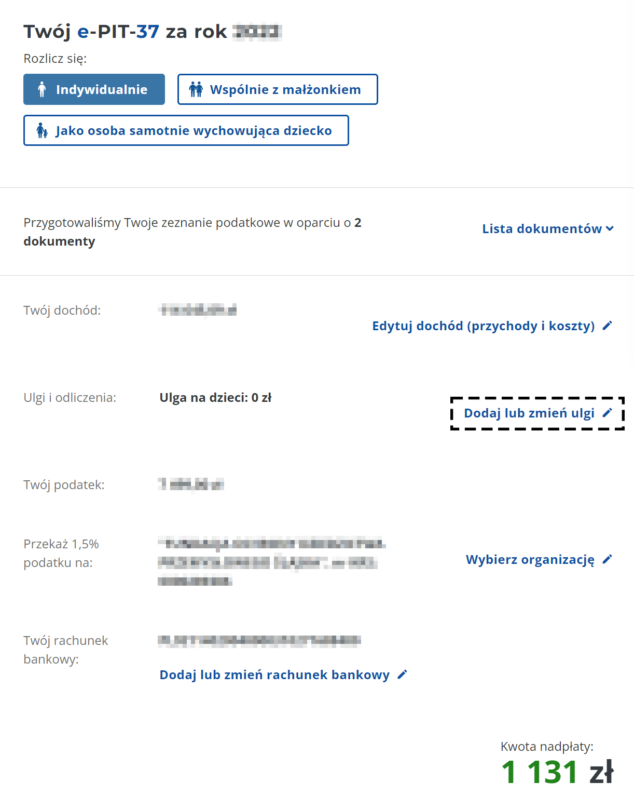

**Jak odpisać od podatku darowiznę na Fundację Fab Foundation Poland?**

**1.** Po zalogowaniu do e-Urzędu Skarbowego i wybraniu moich PITów, w e-PIT-37 za odpowiedni rok podatkowy, w którym została dokonana darowizna na rzecz fundacji, kliknij *Dodaj lub zmień ulgi*.

**2.** Z listy dostępnych ulg, kliknij *Edytuj dane* w sekcji *Darowizny*.

**3.** Zaznacz pole *Na działalność pożytku publicznego*. W polu *Kwota odliczenia (...)* podaj całkowitą kwotę darowizn przekazanych oragnizacjom prowadzącym działalność pożytku publicznego.

**4.** Następnie nawiguj na dół strony i kliknij *Dodaj* pod sekcją *Lista obdarowanych*.

**5.** Uzupełnij pola *Nazwa obdarowanego(...)*: Fundacja Fab Foundation Poland, *Kraj(...)*: Polska, *Kwota przekazanej darowizny (...)*: wpisz kwotę przekazanej nam darowizny. Następnie kliknij *Dodaj*. Uwaga! Lista obdarowanych to lista wszystkich organizacji, którym przekazałeś darowizny - wymień je wszystkie wraz z adekwatnymi kwotami.  Następnie kliknij *Zatwierdź*. Jeśli przekazywałeś 1,5% podatku na organizację OPP, otrzymasz komunitkat jak poniżej. Kliknij *Zatwierdź*.

**6.** W sekcji *Darowizny* powinieneś zobaczyć swoją kwotę odliczenia.

**7.** W e-PIT-37 w sekcji *Ulgi i odliczenia* powinno pojawić się pole: *Inne ulgi podatnika: kwota darowizn*.

