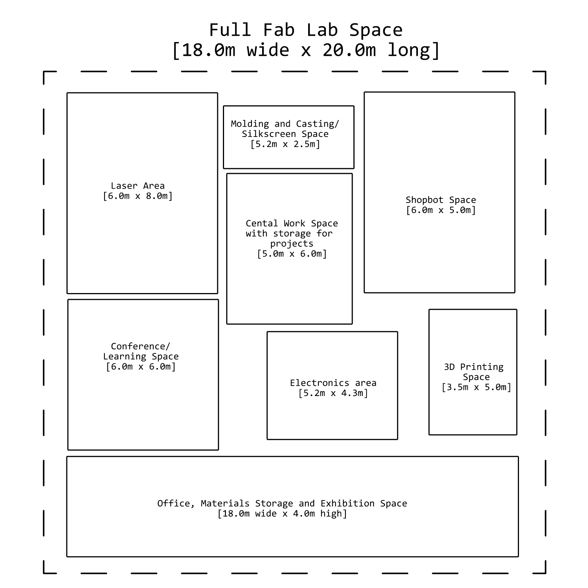
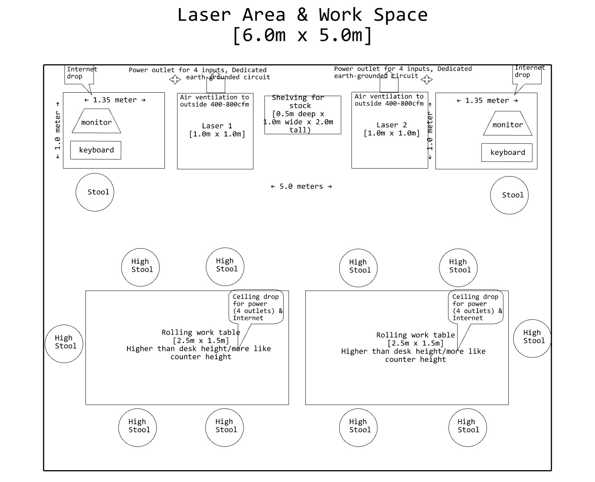

# Fab Lab

We are working on finding proper spaces and establishing new Fab Lab facilities in Poland.
We are looking for the spaces of around 100-500m2 with preferably 3.5-4m height. The model fablab spaces are sketed below. The provided drawings were prepared based on the [how to start a fab lab](https://fabfoundation.org/getting-started/#fab-lab-questions).

## Fab Lab Areas

