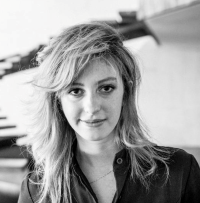
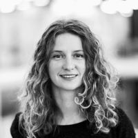

The International Scientific Council is a scientific, advisory, and representative body of the Foundation. The members of the International Scientific Council are world-class scientists and experts in the field of digital design, fabrication, technology, and art. Members of ISC advise on and lead research projects carried out by Fab Foundation Poland.

____________________________

### ** Prof. Dr. Philippe Block**

Philippe Block is professor at the Institute of Technology in Architecture (ITA) at ETH Zurich, where he leads the Block Research Group (BRG) with Dr. Tom Van Mele and is Head of the Institute. Philippe is also Director of the Swiss National Centre of Competence in Research (NCCR) on Digital Fabrication. He studied architecture and structural engineering at the Vrije Universiteit Brussel and at the Massachusetts Institute of Technology, where he earned his PhD in 2009. Philippe and Tom apply their research into practice providing innovation in (computational) design, engineering, fabrication and construction of sustainable, circular and economical structures, addressing climate change by significantly reducing embodied emissions, utilising fewer single-use resources and minimising construction waste.

Following the motto “strength through geometry” and the principles of traditional unreinforced masonry construction, the BRG translates this knowledge into projects such as the unreinforced stone Armadillo Vault, the thin, flexibly formed concrete shells of the NEST HiLo and KnitCandela, the 3D-concrete-printed masonry bridge Striatus, and the Rippmann Floor System (RFS), a lightweight and ultra-low-embodied floor system.

[Link to website](https://block.arch.ethz.ch/)
____________________________

### ** Asst. Prof.  Gabriela Bìlá**

Gabriela Bìlá is a Brazilian architect, multimedia designer and artist. She uses discussions over the contemporary city as the raw material of her work, combining new media and immersive interfaces to reimagine cities.

Gabriela is currently based in Cambridge Massachusetts, working as a Research Scientist and lecturer at the MIT Media Lab City Science group. Her line of research focuses on developing new immersive experiences to envision how humans will adapt to global changes and incorporation of new technologies in daily life. Her work has been featured at the Venice Architecture Biennale and the Guggenheim Bilbao. She has previously worked at various design and architecture offices such as OMA Rotterdam and LAVA Berlin.

Contact: gba@mit.edu

[Link to website](https://www.media.mit.edu/people/gba/overview/)

____________________________

### ** Dr. Mariana Popescu**

Mariana Popescu is a computational architect and structural designer with a strong interest and experience in innovative ways of approaching the fabrication process and use of materials in construction. She is Assistant Professor of Parametric Structural Design
and Digital Fabrication at the Delft University of Technology, Faculty of Civil engineering and Geosciences. Her area of expertise is computational and parametric design with a focus on digital fabrication and sustainable design. Her extensive involvement
in projects related to promoting sustainability has led to a multilateral development of skills, which combine the fields of architecture, engineering, computational design and digital fabrication. She obtained her PhD in 2019 from ETH Zurich with a focus
on the development of KnitCrete - a flexible formwork system using knitted textiles. She is the main author of the award-winning KnitCandela shell and was named a “Pioneer” in the MIT Technology Review Innovator Under 35 list of 2019.

[Link to website](http://maadpope.com/)

____________________________

### ** Prof. Jacek Kościuk**

Prof. Kościuk is an innovator in the application of 3D scanning for creating digital documentation of historical and archeological objects. 3D laser scanning, modeling and simulations not only enhance the heritage documentation with the 3D digital twins, but it also can aid dating the objects by analysis of brics dimensions or helped to discover the ancient Incaic measuring units. The 3D documentation made with sub-millimeter precision is of key importance for monitoring atmospheric and climatic factors causing erosion processes and implementing proper conservation programs. Over 40 years of experience in building archaeology and architectural monument preservation in Poland and worldwide, including +15 sites from the UNESCO World Heritage List e.g.  Temple of Hatshepsut in Deir el-Bahari (Egypt), El Fuerte de Samaipata (Bolivia), Corikancha temple in Cusco and  Machu Picchu (Peru).

In 2007 he founded the  the Laboratory of 3D Scanning and Modeling within Wroclaw University of Technology and Science (TU Wroclaw), which he was supervising as a head-director. Prof. Kościuk was the first professor in Poland who supervised doctoral thesis into digital design, 3D scanning, simulation and optimization. Thanks to him the Laboratory of Digital Fabrication [LabDigiFab](https://labdigifab.wordpress.com/) was funded within TU Wroclaw. This student organization was a unique opportunity at that time to get skills and knowledge about digital design and fabrication. The former students of LabDigiFab, continued their education graduating from among others MIT, UCL Bartlett or ICD Stuttgart.  During its activity LabDigiFab organized in 2015 first in Poland International Conference of Parametric Design *Shapes of Logic* [link](https://shapesoflogic.wordpress.com/), followed in 2017 by its second edition [link](https://es-la.facebook.com/shapesoflogic/).

In 2020 Prof. Kosciuk was awarded the highest scientific nomination by the Polish President. By younger generations he is often referred to as a father (or a god father) of bringing new technologies into architectural education in Poland.

More at: [linkedin](https://www.linkedin.com/in/jacek-ko%C5%9Bciuk-1347452/)

____________________________

### **Prof. Janusz Rębielak**

Polish architect and engineer, professor of technical sciences. He has been working at
the Cracow University of Technology (TU
Cracow) since 2008. He was a head of Chair
of Structures and Construction Engineering
(A-42) and moreover he was head of
Postgraduate Study BIM “Building Information
Modeling – digital technologies in
architecture and construction” at the TU
Cracow.
His research work evolves around numerical
methods for shaping spatial structures as
well as proposals for their applications for
high span roof systems, high-rise buildings
and the innovative methods of their safe
foundation on soils with poor load capacity,
especially on mining damage sectors and in
earthquake areas . His original system of
combine foundation is a breakthrough
technical solution in this area of
engineering activities. He also developed a
two-stage method of calculation of
statically indeterminate trusses and a
method of secondary grid deformation, which
enables to design the most regular

triangular grids for geodesic domes; he is
also involved in working out the innovative
concepts of the structural systems for the
vertical take-off and landing airplanes and
for the short take-off and landing
airplanes, as well as the innovative
concepts of the technical solutions for the
retractable roof structures. So far he
published over 230 scientific papers.
Prof. Rębielak has been a Chairman of the
Committee on Architecture and Urban Planning
of the of Wroclaw Branch of the Polish Academy
of Sciences (PAN) since 2006 and he was member
of some national and international scientific
societies as well as a member of scientific
boards or editorial committees of national and
international scientific journals; at present,
among others, a member of the Editorial Board of
The International Journal of Computational
Methods (IJCM).

More at: [http://januszrebielak.pl](http://januszrebielak.pl) and [wikipedia](https://pl.wikipedia.org/wiki/Janusz_R%C4%99bielak).
